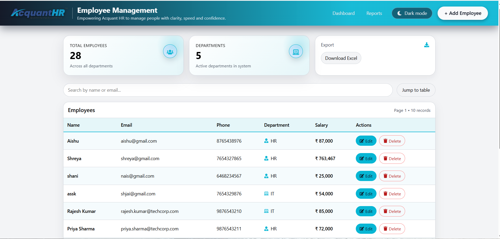
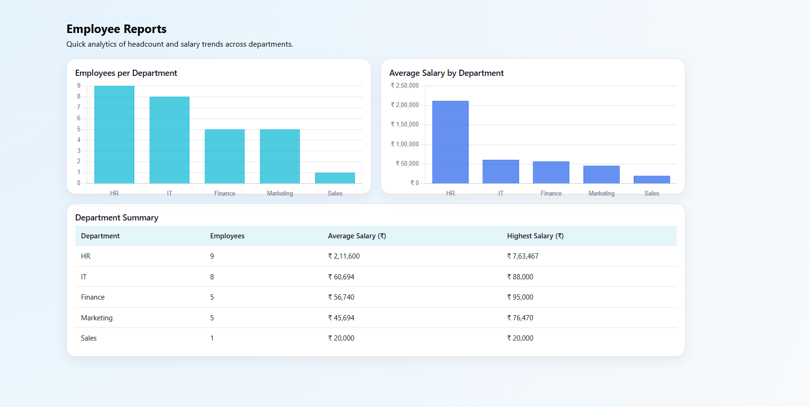
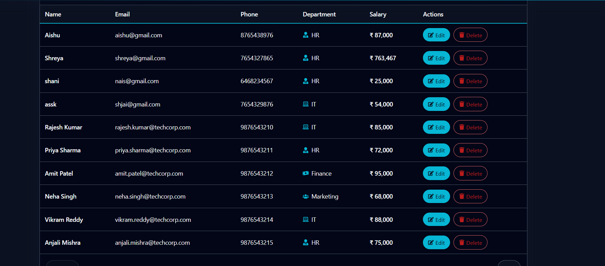

# Employee Management System (EMS)

## Short Description

A full-stack **Employee Management System (EMS)** built using:

* **Frontend**: React
* **Backend**: Node.js + Express
* **Database**: MySQL

The application is designed to manage employees efficiently with modern UI/UX features, validation, and bulk data handling.

---

## Features

* ✅ Employee CRUD (Create, Read, Update, Delete)
* ✅ Client-side and server-side validation
* ✅ Unique email validation with friendly error message
* ✅ Search by **name** or **email**
* ✅ Sorting on multiple columns:

  * Name
  * Email
  * Department
  * Salary
* ✅ Pagination
* ✅ Department-wise summary
* ✅ Department icons (IT, HR, Finance, Marketing, Sales)
* ✅ Export employees to **Excel**
* ✅ Bulk upload employees from **Excel / CSV**
* ✅ Light / Dark theme toggle
* ✅ Animated stat cards
* ✅ Company footer with registered & corporate office details

---

## Screenshots

> Place your screenshots inside: `docs/images/`

```text
docs/images/
  HomePage.png
  ReportsPage.png
  EmployeeTable.png
  bulk_upload.png
```

### Dashboard / Employee List







---

## Repository Structure (Top Level)

```text
ems-application/
│
├── backend/               → Node/Express API (MySQL)
├── frontend/              → React frontend
├── docs/
│   └── images/            → Screenshots used by README
└── README.md              → Project documentation
```

---

## Backend Structure

```text
backend/
 ├── app.js                     → Express app entry
 ├── db.js                       → MySQL connection pool
 ├── models/
 │    └── employee.js           → Employee model & queries
 ├── controllers/
 │    └── employeeController.js → CRUD, search, bulk upload, validation
 ├── routes/
 │    └── employeeRoutes.js     → /employees routes
 └── package.json
```

---

## Frontend Structure

```text
frontend/
 ├── src/
 │   ├── App.js
 │   ├── components/
 │   │   ├── NavBar.js
 │   │   ├── SearchBar.js
 │   │   ├── EmployeeTable.js
 │   │   ├── Pagination.js
 │   │   └── DepartmentChart.js
 │   ├── pages/
 │   │   ├── Dashboard.js
 │   │   ├── EmployeeListPage.js
 │   │   ├── AddEmployeePage.js
 │   │   ├── AddEditEmployeePage.js
 │   │   └── ReportsPage.js
 │   └── assets/
 │       └── logo.png
 └── package.json
```

---

## Quick Start (Development)

### 1. Start the Backend

```bash
cd backend
npm install
```

Edit `backend/db.js`:

```js
const mysql = require("mysql2/promise");

const pool = mysql.createPool({
  host: "localhost",
  user: "root",          // your MySQL user
  password: "password",  // your MySQL password
  database: "ems",       // created DB
});

module.exports = pool;
```

Create database and table:

```sql
CREATE DATABASE ems;
USE ems;

CREATE TABLE employees (
  id INT AUTO_INCREMENT PRIMARY KEY,
  name VARCHAR(60) NOT NULL,
  email VARCHAR(100) NOT NULL UNIQUE,
  phone VARCHAR(20) NOT NULL,
  department VARCHAR(50) NOT NULL,
  salary DECIMAL(15,2) NOT NULL
);
```

Run the backend:

```bash
npm start
```

Backend runs at:

```text
http://localhost:5000
```

---

### 2. Start the Frontend

```bash
cd frontend
npm install
npm start
```

Frontend runs at:

```text
http://localhost:3000
```

Make sure your API URLs in React files
(`EmployeeListPage.js`, `AddEmployeePage.js`, `AddEditEmployeePage.js`)
point to:

```text
http://localhost:5000
```

---

## Important Notes

### Backend is the source of truth for:

* Employee data
* Email uniqueness
* Salary values & validation

### Frontend handles:

* UI & forms
* Basic validation (lengths, formats)
* Theme toggle & animations
* User experience (checkmarks, smooth scrolling)

---

## Bulk Upload

* Supports: **.xlsx, .xls, .csv**
* Skips invalid or duplicate rows
* Continues with valid entries

---

## Duplicate Email Handling

If a duplicate email is found, the backend throws **ER_DUP_ENTRY** and sends a custom message:

```text
"Please enter a valid email ID. The given email ID already exists."
```

---

## Future Improvements

* Authentication & role-based access (Admin / HR)
* Profile photos for employees
* Advanced visual reports & charts
* Export filtered data
* Docker configuration

---

## Author

**Aishwarya**
GitHub: [https://github.com/Aishwarya-I](https://github.com/Aishwarya-I)
